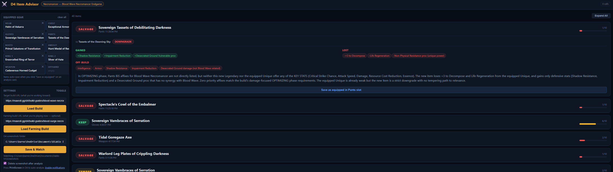

# D4 Item Advisor

A local AI overlay for Diablo 4 that analyzes item tooltips against your Maxroll build guide in real time.

Press PrintScreen in D4 → get a verdict in your browser within a few seconds.



## What it does

- **Analyzes item screenshots** using Claude's vision API and your loaded build guide
- **Tells you KEEP / TEMPER / SALVAGE** with specific reasoning for your build
- **Compares against your equipped item** — shows what you'd gain and lose
- **Tracks build-enabling uniques** you still need and where to farm them
- **Adapts by phase** — survival-focused advice while you're still progressing, BiS-focused once your build is active
- **Saves your equipped loadout** for persistent comparison across sessions

## Requirements

- [Bun](https://bun.sh) runtime (v1.0+)
- An [Anthropic API key](https://console.anthropic.com/) (Claude API — pay per use, typical session costs cents)
- Diablo 4 on the same machine (or screenshot files accessible to the server)

---

## Installation

### Windows (native)

1. **Install Bun**
   ```powershell
   powershell -c "irm bun.sh/install.ps1 | iex"
   ```
   Restart your terminal after installation.

2. **Clone and install**
   ```powershell
   git clone https://github.com/yourname/d4-advisor.git
   cd d4-advisor
   bun install
   ```

3. **Set your API key**

   Create a `.env` file in the project folder:
   ```
   ANTHROPIC_API_KEY=sk-ant-...
   ```

4. **Start the server**
   ```powershell
   bun start
   ```

5. **Open the UI** → [http://localhost:4002](http://localhost:4002)

---

### Windows (WSL2)

Same as above but run all commands inside your WSL terminal. The screenshot watcher accepts Windows paths (`C:\Users\...`) and converts them automatically.

---

### macOS

1. **Install Bun**
   ```bash
   curl -fsSL https://bun.sh/install | bash
   ```

2. **Clone and install**
   ```bash
   git clone https://github.com/yourname/d4-advisor.git
   cd d4-advisor
   bun install
   ```

3. **Set your API key**
   ```bash
   echo "ANTHROPIC_API_KEY=sk-ant-..." > .env
   ```

4. **Start the server**
   ```bash
   bun start
   ```

5. **Open the UI** → [http://localhost:4002](http://localhost:4002)

> **macOS note:** The automatic screen-capture button uses PowerShell and only works on Windows. On macOS, use the **paste** shortcut (⌘V after taking a screenshot with ⌘⇧4 → space) or drag images onto the drop zone.

---

## Setup

### 1. Load a build guide

Paste a Maxroll build URL into the **Settings** panel and click **Load Build**.

```
https://maxroll.gg/d4/build-guides/bone-spear-necromancer-guide
```

The advisor extracts your priority affixes per slot and identifies the critical uniques you need.

### 2. Set your screenshots folder

Point the advisor at D4's screenshot output folder:

- **Windows:** `C:\Users\YourName\Documents\Diablo IV\Screenshots`
- **macOS:** `~/Documents/Diablo IV/Screenshots`

Click **Save & Watch**. Every new screenshot in that folder is automatically analyzed.

### 3. Analyze items

Three ways to get an analysis:

| Method | How |
|--------|-----|
| **Auto (recommended)** | Press PrintScreen while hovering an item in D4 |
| **Paste** | Take a screenshot, then paste (Ctrl/⌘+V) into the browser tab |
| **Drag & drop** | Drag an image file onto the drop zone in Settings |

For **comparison mode**, hover the item you want to evaluate so D4 shows both your equipped item and the new one side by side, then screenshot.

### 4. Save your equipped loadout

After analyzing a KEEP item, click **Save to Ring 1** / **Save as equipped in [slot]** on the result card. The advisor uses this for comparison on future analyses even if only one tooltip is visible.

To scan your full equipped loadout at once: open your character sheet (C key in D4), screenshot it, and click **Scan Character Sheet**.

---

---

## User's Guide

### Reading a verdict

Every analysis returns a verdict and a score (0–10):

| Verdict | Meaning |
|---------|---------|
| **KEEP** | Strong match for your build — equip it or stash it |
| **TEMPER** | Good base, but one affix is wrong and can be fixed via Tempering |
| **SALVAGE** | Not useful for your build — break it down |

The **score** reflects how many priority affixes matched (roughly: 7+ = strong, 4–6 = decent, <4 = weak). In PREPARING phase the bar is lower — the advisor is judging how well the item helps you farm, not whether it's BiS.

**Comparison mode** activates automatically when D4 shows both your equipped item and the new one side by side. The card shows what affixes you'd gain and lose, and an upgrade verdict (UPGRADE / SIDEGRADE / DOWNGRADE).

---

### Build phases

The advisor changes how it evaluates items based on your progression:

**PREPARING** — you're still missing critical build-enabling items.
- The advisor prioritizes survivability and damage output for your *current* skills, not the target build.
- Salvage threshold is high: only junk items get SALVAGE. Anything that helps you clear content faster is worth keeping.
- The Objectives panel shows what to farm and where.

**OPTIMIZING** — all build enablers are found.
- The advisor evaluates strictly against your target build's BiS affixes per slot.
- KEEP requires 3+ priority affixes. Anything less gets TEMPER or SALVAGE.

The phase badge in the top-left of the Objectives panel always shows which mode is active.

---

### Using a farming build

If you're gearing a separate build to farm toward your target (e.g., running a Druid farmer to fund a Necromancer endgame build):

1. Paste your farming build's Maxroll URL into **Farming build URL** in Settings and click **Load Farming Build**.
2. The **Transition Plan** panel appears, showing what you still need to unlock your target build.
3. Items are now evaluated against your *farming* build's affixes — not your target build.

As you find critical items, click them in the **Build Enablers** checklist to mark them found.

---

### Switching to endgame mode

When all build enablers are found, the Transition Plan panel shows **"Ready to switch!"** and an **Activate [Build Name]** button turns green.

Clicking it:
- Marks all critical items as found
- Clears the farming build
- Immediately switches the AI to OPTIMIZING mode against your target build's BiS affixes

If you want to switch before finding everything (e.g., the AI recommended it based on your power level), use the **Switch to Endgame Now** button — it does the same thing regardless of checklist state.

---

### Saving your equipped loadout

The advisor can compare a new item against what you're currently wearing even when D4 only shows one tooltip:

1. Analyze a KEEP item and click **Save as equipped** on the result card.
2. On future analyses of the same slot, the advisor automatically pulls the stored item for comparison.

To populate your full loadout at once: open your character sheet (C key in D4), take a screenshot, and click **Scan Character Sheet** in the UI.

---

## Screenshot tips

- Set D4 screenshots to **JPEG** in video settings — smaller files analyze faster (large PNGs are auto-compressed but JPEG is cleaner)
- Hover the item to show the full tooltip before pressing PrintScreen
- For ring comparison, make sure both tooltips are visible on screen

---

## Cost

The analyzer uses Claude's API with prompt caching. A typical play session of 20–50 item analyses costs $0.05–0.15. The token counter in the header tracks your usage.

---

## Hotkey listener (Windows alternative)

If Windows Defender blocks the inline screen capture, use the included hotkey listener instead:

```powershell
.\hotkey-listener.ps1
```

Run it once, approve the execution policy prompt, and it will capture + send screenshots to the advisor on a configurable hotkey.

---

## Troubleshooting

**"Screenshot failed: Windows Defender blocked"**
Use `hotkey-listener.ps1` instead of the Capture button. See [Hotkey listener](#hotkey-listener-windows-alternative) above.

**"Item tooltip not found"**
Make sure the item tooltip is fully visible and not cut off by the screen edge. Hover the item until the tooltip fully appears, then screenshot.

**Build slots show as empty after loading**
Some Maxroll pages are heavily JavaScript-rendered and don't expose slot data in the HTML. The advisor still works — Claude uses the raw guide text. You'll see "⚠ Slot data sparse" in the build panel.

**Large screenshots**
Oversized images are automatically compressed before being sent to Claude, so they should never fail due to size. If quality looks poor, switch D4 to JPEG screenshots in video settings — they're smaller and faster to analyze.

---

## Privacy

All analysis runs locally through the Anthropic API. Screenshots are sent to Anthropic's servers for vision analysis and are subject to [Anthropic's privacy policy](https://www.anthropic.com/privacy). No data is stored anywhere else.
